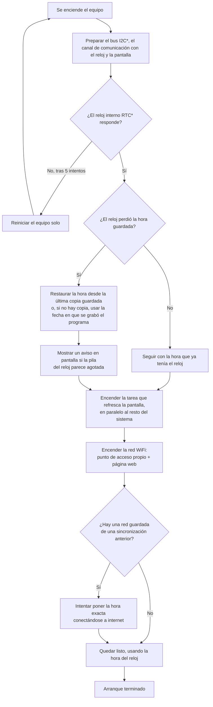
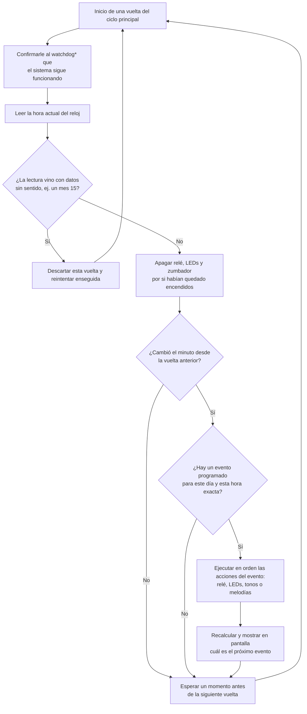
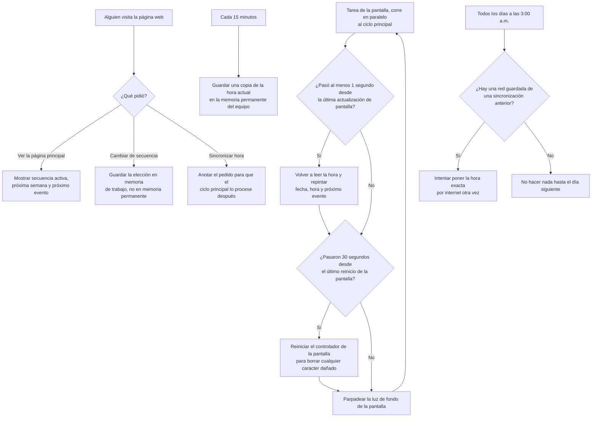

# CODIGO.md — Referencia técnica

Documentación para quien vaya a leer o modificar `src/main.cpp` (único archivo fuente del proyecto, 968 líneas). Todos los datos de esta página fueron verificados línea por línea contra el código y contra `platformio.ini`, no contra documentación previa.

## Tabla de contenido

- [Arquitectura general](#arquitectura-general)
- [Organización del código](#organización-del-código)
- [Timers e intervalos](#timers-e-intervalos)
- [Máquinas de estado](#máquinas-de-estado)
- [Recuperación, reintentos y watchdog](#recuperación-reintentos-y-watchdog)
- [Decisiones de diseño no obvias](#decisiones-de-diseño-no-obvias)
- [Diagramas de flujo](#diagramas-de-flujo)
- [Glosario técnico](#glosario-técnico)

## Arquitectura general

### Capas de almacenamiento

```
┌───────────────────────────────────────────────────────────────┐
│ RAM (se pierde en cada reinicio)                                │
│  - Eleccion, EleccionProximaSemana        (secuencia activa/próx.) │
│  - elegida[MAX_ALARMAS]                   (copia de sec1[] o sec2[]) │
│  - ultimoMinutoRTC, ultimoDiaRTC, ultimoDiaSyncAuto              │
│  - ultimoRespaldoEpoch, arranqueTerminado                        │
│  - lcdProxLine1[21], lcdProxLine2[21]     (texto p/ el LCD)      │
│  - ssidNTP, passNTP, resultadoSync, solicitudSyncNTP             │
└───────────────────────────────────────────────────────────────┘
┌───────────────────────────────────────────────────────────────┐
│ NVS / Preferences (flash interna, partición "nvs", 0x5000 = 20 KB) │
│  - namespace "wifi-cred": ssid (String), pass (String)           │
│  - namespace "rtc-backup": epoch (uint32, unixtime)              │
└───────────────────────────────────────────────────────────────┘
┌───────────────────────────────────────────────────────────────┐
│ RTC DS3231 (chip externo con pila de respaldo propia)            │
│  - Es el único reloj que sigue avanzando mientras el equipo      │
│    está apagado, y solo si su pila de respaldo funciona          │
└───────────────────────────────────────────────────────────────┘
┌───────────────────────────────────────────────────────────────┐
│ Flash de aplicación (particiones app0/app1, 0x1E0000 = ~1.9 MB c/u) │
│  - El binario del firmware, incluyendo sec1[]/sec2[] (hardcode-  │
│    adas en el código: no se pueden editar sin recompilar)        │
│  - Uso actual verificado en la última build: 851 645 bytes (43 %)│
└───────────────────────────────────────────────────────────────┘
```

La tabla de particiones (`min_spiffs.csv`, ver `platformio.ini`) reserva `app0` y `app1` (dos particiones de aplicación tipo OTA), pero el firmware no contiene ningún código de actualización OTA — solo se usa `app0` al subir por USB. La existencia de `app1` es un remanente de la tabla de particiones estándar, no una funcionalidad implementada.

### Flujo principal de ejecución

`setup()` corre una sola vez. Después, tres flujos de ejecución concurrentes comparten el bus I2C (RTC + LCD): el `loop()` principal (núcleo 0), la tarea `tareaLCD()` (pineada al núcleo 1) y el servidor web asíncrono, que despacha sus callbacks desde una tarea propia llamada `"async_tcp"` creada por la librería AsyncTCP (`xTaskCreateUniversal(_async_service_task, "async_tcp", ...)` en `AsyncTCP.cpp`). Ese es el motivo por el que todo acceso al RTC y al LCD pasa por un mutex (`i2cMutex`) — ver [Recuperación, reintentos y watchdog](#recuperación-reintentos-y-watchdog).

```
setup()                                    loop()  [núcleo 0]           tareaLCD()  [núcleo 1]
  una sola vez                              cada ~200 ms + tiempo         cada ~10 ms, repinta
                                             bloqueante de eventos         el LCD cada ≥1 s
     │                                            │                            │
     ▼                                            ▼                            ▼
  inicializa I2C, RTC, LCD                  lee RTC (mutex)              lee RTC (mutex),
  crea tareaLCD()                           dispara eventos              repinta 4 filas,
  levanta AP+STA y servidor web             tareas periódicas            reinicia LCD c/30 s,
  intenta NTP con credenciales guardadas    (backup NVS, resync 3am)     parpadea backlight

                                        servidor web (AsyncTCP, tarea "async_tcp",
                                        dirigido por eventos, no por sondeo)
                                             │
                                             ▼
                                        GET /  ·  GET /set  ·  GET /wifi-sync
                                        (lee RTC vía mutex solo en GET /)
```

## Organización del código

Rangos de línea verificados contra el archivo actual (968 líneas totales):

| Rango       | Contenido |
|-------------|-----------|
| 1–12        | Includes |
| 14–27       | Prototipos de funciones |
| 29–41       | Pines de hardware, pines I2C, `WDT_TIMEOUT_S` |
| 43–72       | Constantes de tipos de acción (`SIN_ACCION`…`MELODIA_MARIO`) y `DURACION_ACCION_MS` |
| 74–86       | Objetos periféricos (`rtc`, `lcd`, `servidor`, `prefs`) y el mutex `i2cMutex` |
| 88–94       | Configuración del AP WiFi |
| 96–114      | Variables globales de estado (elección de secuencia, sync NTP, texto del LCD, control de arranque) |
| 116–130     | `struct Alarma` |
| 132–214     | Secuencias de eventos `sec1[]` y `sec2[]` |
| 216–222     | `N_SEC1`, `N_SEC2`, `MAX_ALARMAS`, `elegida[]` |
| 225–317     | Funciones de eventos (`activarRele`…`reproducirMelodia_Mario`) |
| 320–342     | `ejecutarAccion()` (dispatcher) |
| 345–354     | `copiarSecuencia()` |
| 357–421     | `sincronizarNTP()` |
| 424–470     | `actualizarProximoEvento()` |
| 473–555     | Funciones de robustez I2C/RTC (`recuperarBusI2C`, `iniciarI2C`, `rtcNowSafe`, `rtcBeginSafe`, `rtcLostPowerSafe`, `rtcAdjustSafe`, `fechaValida`) |
| 558–792     | `setup()` |
| 795–896     | `loop()` |
| 899–968     | `tareaLCD()` |

Headers auxiliares en `include/`:

| Archivo | Contenido |
|---------|-----------|
| `piezo-music.h` | `#define` de frecuencias de notas musicales (`NOTE_*`) y una función `playSong()` **que el proyecto no llama en ningún lado** — `main.cpp` implementa su propia `tocarMelodia()` con límite de tiempo en su lugar. |
| `example-music.h` | Arreglos de melodía/ritmo para Twinkle Twinkle, Zelda, Tetris y Mario (usados) y `mario_underworld_melody`/`mario_underworld_rythm` (definidos pero **nunca referenciados** por ninguna constante `MELODIA_*` ni por `ejecutarAccion()`). |

## Timers e intervalos

Valores tomados directamente de las constantes numéricas del código, no de los comentarios (algunos comentarios están desactualizados, ver [Decisiones de diseño no obvias](#decisiones-de-diseño-no-obvias)):

| Timer / intervalo | Valor real | Dónde |
|--------------------|------------|-------|
| `DURACION_ACCION_MS` | 10 000 ms | Aplica a `LED_1/2/3`, `SEQ_LEDS`, `PARPADEO_LEDS`, `TONO_*` y como tope máximo de las melodías. **No** aplica al relé. |
| Pulso del relé (`activarRele`) | 3 × (2000 ms ON + 2000 ms OFF) = 12 000 ms fijo | Hardcodeado, ignora `DURACION_ACCION_MS` |
| `WDT_TIMEOUT_S` (watchdog) | 20 s | `esp_task_wdt_init(WDT_TIMEOUT_S, true)` — el segundo argumento `true` hace que el vencimiento provoque un reinicio del sistema, no solo una interrupción |
| Ciclo del `loop()` en reposo | `delay(200)` por vuelta | Al final de `loop()`, cuando no hay evento disparándose |
| Espera de estabilización al arrancar | 3000 ms (`millis() < 3000UL`) | Antes de habilitar el disparo de eventos |
| Ciclo de `tareaLCD()` | `delay(10)` por vuelta | Repintado real del LCD solo cuando pasaron ≥1000 ms desde el anterior |
| Parpadeo del backlight | 80 ms encendido / 10 ms apagado | El comentario en el código dice "300 ms / 50 ms" — es incorrecto; los valores reales son los de las comparaciones `>= 80` y `>= 10` |
| Reinicialización periódica del LCD | cada ≥30 000 ms | Autocorrección de caracteres corruptos |
| Respaldo de hora en NVS | cada ≥900 000 ms (15 min) | Independiente de cualquier sincronización NTP |
| Resincronización NTP diaria | chequeo cada minuto, dispara una sola vez cuando son las 03:00 | Guardado en `ultimoDiaSyncAuto` |
| Timeout de conexión WiFi STA (`sincronizarNTP`) | 20 000 ms | `while (WiFi.status() != WL_CONNECTED && millis() - inicio < 20000UL)` |
| Timeout de respuesta NTP (`getLocalTime`) | 10 000 ms | Dentro de `sincronizarNTP()` |
| Reintentos de detección del RTC al arrancar | 5 intentos, 300 ms entre cada uno | `for (int intento = 0; intento < 5 ...)` en `setup()` |
| Timeout de transacción I2C (`Wire.setTimeOut`) | 200 ms | Fijado en `iniciarI2C()` |
| Pausa tras el cambio semanal de secuencia | 60 × 1000 ms = 60 000 ms | En bloques de 1 s para poder alimentar el watchdog durante la espera |

## Máquinas de estado

### Ciclo de arranque (`arranqueTerminado`)

```
[arranqueTerminado = false] ──(millis() < 3000)──► sigue en este estado, cada vuelta del loop() solo espera
[arranqueTerminado = false] ──(millis() >= 3000)──► guarda minuto/día actuales como "ya vistos" ──► [arranqueTerminado = true]
```

Por qué existe: si el equipo se reinicia justo en el minuto exacto de un evento programado, sin esta espera podría disparar ese evento con los periféricos todavía inicializándose a medias. Marcar el minuto actual como "ya visto" también evita que ese mismo minuto se vuelva a disparar apenas termine la espera.

### Selección de secuencia (`Eleccion` / `EleccionProximaSemana`)

Ambas son `byte` con dos valores posibles (0 = Secuencia 1, 1 = Secuencia 2). Solo hay dos formas de que cambien:

```
GET /set?ahora=N        ──► Eleccion = N (inmediato, re-copia elegida[] al instante)
GET /set?ahora=&luego=M ──► EleccionProximaSemana = M (solo se aplicará el próximo lunes)

Lunes 00:00 y Eleccion != EleccionProximaSemana
        │
        ▼
Eleccion = EleccionProximaSemana
copiarSecuencia()
pausa de 60 s (evita reevaluar la condición varias veces en el mismo minuto)
```

Ninguno de los dos valores se guarda en NVS: ambos vuelven a 0 (Secuencia 1) en cada reinicio del equipo.

## Recuperación, reintentos y watchdog

Secuencia implementada tal cual está en el código (no es la secuencia "estándar" de ningún protocolo, es específica de este firmware):

1. **`recuperarBusI2C()`** — antes de cualquier `Wire.begin()`: pone SDA y SCL en `INPUT_PULLUP` y espera 10 ms. Si SDA ya está en alto, el bus está libre y no hace nada más. Si SDA está en bajo (un esclavo lo retiene), genera hasta 9 pulsos manuales de reloj en SCL y termina con una condición STOP manual (SDA sube mientras SCL está en alto) — la técnica estándar de recuperación de bus I2C.
2. **`iniciarI2C()`** — llama a `recuperarBusI2C()`, luego `Wire.begin(21, 22)` y fija `Wire.setTimeOut(200)` (milisegundos) para que ninguna transacción I2C quede bloqueada indefinidamente.
3. **Detección del RTC en `setup()`** — hasta 5 intentos de `rtcBeginSafe()`; entre cada intento fallido se vuelve a llamar `iniciarI2C()` (recuperación de bus incluida) y se espera 300 ms. Si los 5 intentos fallan, se muestra un mensaje de error en el LCD y se llama `esp_restart()` — un reinicio limpio del ESP32, en vez del `while(true);` que quedaba colgado para siempre en versiones anteriores del código.
4. **Mutex `i2cMutex`** — todas las funciones que tocan el bus I2C (`rtcNowSafe`, `rtcBeginSafe`, `rtcLostPowerSafe`, `rtcAdjustSafe`, y el bloque de escritura del LCD dentro de `tareaLCD()`) toman este mutex antes de cualquier transacción y lo liberan justo después. Esto evita que dos tareas (por ejemplo el `loop()` leyendo el RTC y `tareaLCD()` escribiendo el LCD al mismo tiempo) interrumpan una transacción a medias, que es lo que corrompía datos y podía dejar el bus en un estado inconsistente. El mutex **no** protege los pines de relé/LEDs/zumbador: esos son GPIO simples, sin bus compartido, así que no lo necesitan.
5. **`fechaValida()`** — cualquier lectura del RTC se valida (año 2020–2099, mes 1–12, día 1–31, hora/minuto/segundo en rango) antes de usarse. Una lectura corrupta se descarta silenciosamente (se reintenta en el siguiente ciclo) en `loop()`, en `actualizarProximoEvento()` y en `tareaLCD()`.
6. **Watchdog de tareas (`esp_task_wdt`)** — se inicializa una sola vez en `setup()` con `esp_task_wdt_init(20, true)`. Dos tareas se suscriben con `esp_task_wdt_add(NULL)`: la tarea de `setup()`/`loop()` y `tareaLCD()`. Ambas deben llamar `esp_task_wdt_reset()` periódicamente; los puntos de alimentación son: el inicio de cada vuelta de `loop()`, después de cada acción individual dentro de un evento (porque una sola acción puede durar hasta ~12 s), dentro de los dos bucles de espera de `sincronizarNTP()` (conexión WiFi y espera de NTP), durante los 60 × 1 s de pausa tras el cambio semanal de secuencia, y en cada vuelta de `tareaLCD()`. Si alguna de las dos tareas deja de alimentar el watchdog durante 20 s seguidos, el ESP32 se reinicia solo.
7. **Reinicialización periódica del LCD** — cada ≥30 s, `tareaLCD()` llama `lcd.init()` de nuevo (bajo el mismo mutex). No depende de detectar un error real: es una autocorrección preventiva y periódica, no reactiva.

## Decisiones de diseño no obvias

- **El relé ignora `DURACION_ACCION_MS`.** Todas las demás acciones usan esa constante para su duración; `activarRele()` tiene sus 2000 ms hardcodeados en el código (3 pulsos de 2 s ON + 2 s OFF = 12 s fijos). Cambiar `DURACION_ACCION_MS` no afecta el pulso del relé — quien vaya a ajustar tiempos debe recordar tocar `activarRele()` aparte.
- **El comentario del backlight en el código está desactualizado.** Dice "300 ms encendido / 50 ms apagado" pero las comparaciones reales son `>= 80` y `>= 10` (80 ms / 10 ms). Se prioriza el valor numérico real sobre el comentario, como corresponde.
- **Hay una entrada duplicada en `sec2[]`:** `{6, 18, 0, {RELE}}` aparece dos veces (una junto a `{6, 18, 30, {PARPADEO_LEDS}}` y otra como última línea del arreglo). Como el disparo de eventos en `loop()` hace `break` apenas encuentra la primera coincidencia de día/hora/minuto, la segunda copia nunca se ejecuta: es dato muerto, no un bug de doble disparo.
- **`Eleccion` y `EleccionProximaSemana` no se persisten en NVS.** A diferencia de las credenciales WiFi y del respaldo de hora, la elección de secuencia vive solo en RAM. Es un comportamiento verificado del código actual, no necesariamente la intención original — quien dependa de que la secuencia elegida sobreviva a un reinicio debe agregar esa persistencia.
- **`MAX_ALARMAS` se calcula dinámicamente:** `const int MAX_ALARMAS = (N_SEC1 > N_SEC2) ? N_SEC1 : N_SEC2;`, con `N_SEC1`/`N_SEC2` obtenidos de `sizeof(sec1)/sizeof(sec1[0])`. Esto corrige una versión anterior de esta documentación que afirmaba que `elegida[]` estaba "fijo en 28 entradas" y que `sec1[]`/`sec2[]` debían tener exactamente ese tamaño o el copiado leería fuera de rango — eso ya no aplica: el arreglo se ajusta solo al tamaño real de cada secuencia, sea cual sea.
- **Restricción real sobre la duración de un evento combinado:** mientras `loop()` ejecuta las acciones de una entrada que coincidió, no vuelve a leer el RTC hasta terminar todas las acciones de esa entrada. Si la suma de duraciones de una entrada llegara a superar el margen hasta el siguiente minuto (~60 s), el evento programado para ese minuto siguiente se saltaría por completo (nunca se evalúa ese instante intermedio). Con los datos actuales el combo más largo es de ~32 s (por ejemplo `{RELE, MELODIA_ZELDA, LED_2}` ≈ 12 000 + ≤10 000 + 10 000 ms), lejos de ese límite. Esto corrige una cifra de una versión anterior de esta documentación que hablaba de "3 delays de 18 s (54 s total)" para un supuesto "caso 4 / secuencia LED4" — no existe ninguna función así en el código actual; probablemente describía una versión anterior del firmware.
- **El reset de actuadores al inicio de cada vuelta de `loop()` es incondicional.** `digitalWrite(PIN_RELE, LOW)` y el apagado de los 3 LEDs y el zumbador se ejecutan siempre, incluso durante los 3 s de espera de estabilización al arrancar — es una medida defensiva, no depende de ningún estado previo.
- **`Adafruit PN532` y `ESP Mail Client` están declaradas en `platformio.ini` pero no se usan.** Ningún archivo de `src/` ni de `include/` las incluye. Si se van a quitar, no deberían romper ninguna funcionalidad actual.
- **`playSong()` (en `piezo-music.h`) y `mario_underworld_melody`/`mario_underworld_rythm` (en `example-music.h`) son código muerto.** El proyecto reimplementa su propia reproducción de melodías (`tocarMelodia()`, con corte a los `DURACION_ACCION_MS`) en vez de usar `playSong()`, y nunca referencia el tema "Mario Underworld".

## Diagramas de flujo

### Arranque



### Ciclo principal



### Tareas de fondo (pantalla, página web y copias de seguridad)



## Glosario técnico

| Término | Explicación en palabras simples |
|---------|-----------------------------------|
| I2C | Protocolo de comunicación con solo dos cables (datos y reloj) que usan varios chips para hablar entre sí; aquí lo comparten el reloj (RTC) y la pantalla. |
| RTC | "Reloj de tiempo real": un chip dedicado solo a llevar la fecha y hora, con su propia pila para seguir funcionando aunque se apague el equipo principal. |
| NVS / Preferences | Un espacio de la memoria flash del ESP32 que guarda datos pequeños (como contraseñas o un número) y los conserva aunque el equipo se apague. |
| Mutex (semáforo) | Un mecanismo que asegura que solo una tarea a la vez pueda usar un recurso compartido (aquí, el bus I2C), para que dos tareas no se pisen entre sí. |
| Watchdog | Un temporizador de seguridad: si el programa no le "avisa" periódicamente que sigue funcionando, asume que se colgó y reinicia el equipo solo. |
| NTP | Un servicio de internet que permite poner la hora exacta de un reloj, consultando servidores especializados. |
| AP / STA | Dos roles que puede tener la radio WiFi del ESP32 al mismo tiempo: AP (punto de acceso: el ESP32 actúa como un router al que otros dispositivos se conectan) y STA (cliente: el ESP32 se conecta a otra red, como lo haría un celular). |
| Tarea (FreeRTOS) | Un "hilo" de ejecución independiente dentro del mismo programa; el ESP32 puede correr varias tareas en paralelo, cada una en un núcleo del procesador. |
| GPIO | Un pin físico del ESP32 que se puede configurar como entrada o salida digital simple (encendido/apagado). |
| Partición / flash de aplicación | La memoria interna del ESP32 donde vive el programa compilado; está dividida en "particiones" con distintos usos (app, datos, etc.). |
| unixtime / epoch | Una forma de representar una fecha y hora como un solo número: la cantidad de segundos transcurridos desde el 1 de enero de 1970. |
